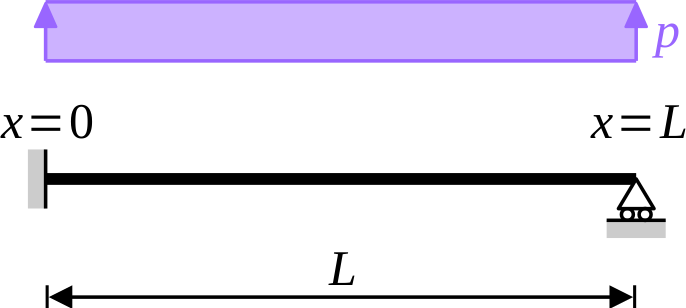

In finite element analysis, Euler–Bernoulli beam elements are usually
based on Hermite shape functions. Did you know that, for **static**
load-cases, the resulting elements deliver the exact solution? “This
is trivial!”, you might think. “The potential energy is minimized over
a subspace that contains the exact solution”. You would be right:
**for concentrated loads applied to the nodes of the structure**, the
finite element displacements based on Hermite shape functions are
indeed exact at any point of the structure. What is probably less
known is that, regardless of the applied loads, the **nodal
displacements** are always exact. In this series, we discuss this
remarkable property.

# Hermite shape functions

Bending of Euler–Bernoulli beams are governed by the following equation (see [Wikipedia](https://en.wikipedia.org/wiki/Euler%E2%80%93Bernoulli_beam_theory))
$$
\frac{\mathrm{d}^2}{\mathrm{d}x} \biggl( EI \, \frac{\mathrm{d}^2 v}{\mathrm{d}x^2} \biggr) = p,
$$
where $v(x)$ denotes the deflection of the beam, $p(x)$ its
(distributed) loading, and $EI$ the bending stiffness. The above
equation is a fourth-order ordinary differential equation: it requires
**four boundary conditions**. For example, the deflections and
rotations might be prescribed at both ends $x = 0$ and $x = L$ of the
beam
$$
v(0) = v_0, \quad
v'(0) = θ_0, \quad
v(L) = v_L
\quad \text{and} \quad
v'(L) = θ_L,
$$
where $v_0$, $v_L$ are the prescribed deflections and $θ_0$, $θ_L$ are
the prescribed rotations.

Let us focus on the case $p \equiv 0$: **the beam is loaded at its
ends only**. Then, $v(x)$ is a third-order polynomial, which is
usually conveniently writen as a linear combination of four *shape
functions*
$$ v(x) = v_0 \, N_1(x) + θ_0 \, N_2(x) + v_L \, N_3(x) + θ_L \, N_4(x), $$
where $N_1$, $N_2$, $N_3$ and $N_4$ are four linearly independent
third-order polynomials defined by the boundary conditions gathered in
table @tbl-20250622142422. These shape functions are usually referred
to as *Hermite interpolation polynomials*. Their precise expression is
not relevant to the present series (see
[Wikipedia](https://en.wikipedia.org/wiki/Hermite_interpolation) for
more details).

| $k$ | $N_k(0)$ | $N_k'(0)$ | $N_k(L)$ | $N_k'(L)$ |
|:---:|:--------:|:---------:|:--------:|:---------:|
| 1   | 1        | 0         | 0        | 0         |
| 2   | 0        | 1         | 0        | 0         |
| 3   | 0        | 0         | 1        | 0         |
| 4   | 0        | 0         | 0        | 1         |

: Boundary conditions for the various shape functions of a
  beam. {#tbl-20250622142422}

Hermite elements are beam elements based on the above Hermite shape
functions. In other words, the total potential energy of the structure
is minimized over the space of displacements that are third-order
polynomials between adjacent nodes, with $\mathrm{C}^1$ continuity at
each node. This is illustrated in the simple example below.

# Example: the propped cantilever

Let us consider the case of a propped cantilever, built-in at the
left-hand side ($x = 0$) and simply supported at the right-hand side
($x = L$). The beam is subjected to a uniformly distributed load $p$
(see figure @fig-20250622164651).

{#fig-20250622164651 width=33%}

The exact solution is classical
$$
v_{\mathrm{exact}}(x)
= \frac{p \, L^4}{48EI} \, \frac{x^2}{L^2} \, \biggl( 3 - 2\frac{x}{L} \biggr) \, \biggl( 1 - \frac{x}{L} \biggr)
$$
and we seek an approximate solution to this problem. Since we want to
mimic what a finite element code would deliver, we seek
$v_{\mathrm{approx}}$ as a third-order polynomial
$$
v_{\mathrm{approx}}(x) = a \, x^3 + b \, x^2 + c \, x + d,
$$
where the boundary conditions $v(0) = 0$, $v'(0) = 0$ and $v(L) = 0$
lead to $d = 0$, $c = 0$ and $b = -a \, L$
$$
v_{\mathrm{approx}}(x) = a \, x^2 \, \bigl( x - L \bigr).
$$

The strain energy $U$ and potential of external forces $V$ are two
functions of the sole remaining unknown, $a$
$$
U(a) = \int_0^L \tfrac{1}{2} \, EI \, \bigl[ v_{\mathrm{approx}}''(x) \bigr]^2 \, \mathrm{d}x = 2EI \, L^3 \, a^2,
$$
$$
V(a) = \int_0^L p \, v_{\mathrm{approx}}(x) \, \mathrm{d} x = -\frac{p \, L^4 \, a}{12}
$$
and the total potential energy $Π$ reads
$$
Π(a) = 2EI \, L^3 \, a^2 -\frac{p \, L^4 \, a}{12}.
$$

The value of the constant $a$ is found from the stationarity condition of the total potential energy
$$
0 = \frac{\mathrm{d}Π}{\mathrm{d}a} = 4EI \, L^3 \, a - \frac{p \, L^4}{12}
\quad \Rightarrow \quad
a = \frac{p \, L}{48EI}
$$
and finally
$$
v_{\mathrm{approx}}(x) = \frac{p \, L^4}{48EI}  \, \frac{x^2}{L^2} \, \biggl( 1 - \frac{x}{L} \biggr).
$$

Obviously, $v_{\mathrm{exact}}$ and $v_{\mathrm{approx}}$ are not
equal! As a consequence, the exact and approximate bending moments at the
built-in support are widely different
$$
M_{\mathrm{approx}}(0) = EI \, v_{\mathrm{approx}}''(0)
= \frac{p \, L^2}{24}
\quad \text{while} \quad
M_{\mathrm{exact}}(0) = EI \, v_{\mathrm{exact}}''(0)
= \frac{p \, L^2}{8}.
$$

Quite surprisingly, though, the nodal displacements coincide. Indeed,
from the boundary conditions
$$
v_{\mathrm{approx}}(0) = v_{\mathrm{exact}}(0) = 0, \quad
v_{\mathrm{approx}}(L) = v_{\mathrm{exact}}(L) = 0
\quad \text{and} \quad
θ_{\mathrm{approx}}(0) = θ_{\mathrm{exact}}(0) = 0.
$$
The remaining degree of freedom, $θ(L)$ is also exact
$$
θ_{\mathrm{approx}}(L) = v'_{\mathrm{approx}}(L) = -\frac{p \, L^3}{48EI}
\quad \text{and} \quad
θ_{\mathrm{exact}}(L) = v'_{\mathrm{exact}}(L) = -\frac{p \, L^3}{48EI}.
$$

🤔 Is this mere coincidence? Of course not!

# Conclusion

Finite element analysis of an assembly of Euler–Bernoulli beams is
usually based on Hermite elements, where the transverse deflection is
a third-order polynomial in each element, while both deflection and
rotation are continuous at each node of the structure.

For loads that are applied **between nodes** (e.g., distributed
loads), the resulting approximate solution differs significantly from
the true solution. However, the **nodal displacements** (deflection
and rotation) are always exact, **provided that the potential of
external forces is evaluated consistently**. This requirement will be
discussed in the [next instalment](../20250701-Hermite_elements_are_exact-02) of this series.
