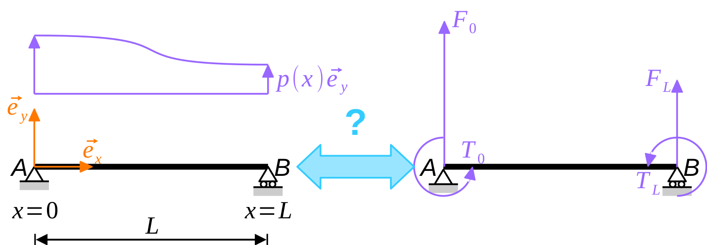
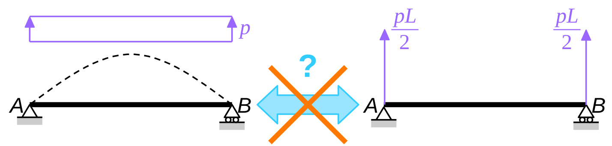
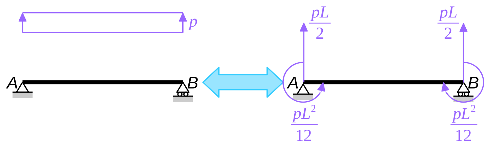

The [previous instalment](../20250622-Hermite_elements_are_exact-01)
of this series closed with the assertion that Hermite elements deliver
exact nodal displacements, **provided that the potential of external
forces is evaluated consistently**. Before we turn to the actual proof
of this statement, we will discuss in the present post what
“consistent evaluation of the potential of external forces” actually
means.

# The problem of sharing loads between nodes

Finite element models arguably know only of **nodal forces and
moments**: distributed loads applied to the real structure must be
replaced by concentrated forces and moments applied to the nodes of
the finite element model.

{#fig-20250701073923}

The process is illustrated in Fig. @fig-20250701073923 with a
horizontal beam $\mathsf{AB}$, subjected to a distributed, transverse
load $p(x) \, \vec{e}_y$ ; the length of the beam is $L$. There are only
two nodes in the corresponding finite element model: $\mathsf{A}$ ($x =
0$ and $y = 0$) and $\mathsf{B}$ ($x = L$ and $y = 0$).

The nodal loads are: nodal forces $\vec{F}_0$ and $\vec{F}_L$, as well
as torques $T_0 \, \vec{e}_z$ and $T_L \, \vec{e}_z$. Intuitively, we
will discard the longitudinal components of the nodal forces and assume
that $\vec{F}_0 = F_0 \, \vec{e}_y$ and $\vec{F}_L = F_L \, \vec{e}_y$.

These end forces and moments must be **equivalent** (in a sense to be
defined) to the **real** distributed load. Of course, we will require
the two systems of loads to be at least **statically** equivalent,
meaning that both the resultant forces and resultant moments are
equal. However, this delivers only **two equations** for **four
unknowns**
$$
F_0 + F_L = \int_0^L p(x) \, \mathrm{d} x,
$$ {#eq-20250627074030}
$$
F_L \, L + T_0 + T_ L = \int_0^L x \, p(x) \, \mathrm{d} x,
$$ {#eq-20250627074036}
which is not enough to define equivalent nodal forces
unequivoquely. How to get to the two missing equations is discussed in
the remainder of this post.

# When common sense fails

In the example depicted in Fig. @fig-20250701073923, common sense would
probably suggest to assume that the end torques are null, $T_0 = 0$ and
$T_L = 0$, which, upon combination with Eqs. (@eq-20250627074030) and
(@eq-20250627074036), delivers
$$
F_0 = \frac{1}{L} \, \int_0^L \bigl( L - x \bigr) \, p(x) \, \mathrm{d} x
\quad \text{and} \quad
F_L = \frac{1}{L} \, \int_0^L x \, p(x) \, \mathrm{d} x
$$
and the nodal forces are defined unambiguously.

For the common case of a uniformly distributed load (UDL), we get $F_0 =
F_L = p \, L / 2$: the load is shared equally between the two nodes.

Unfortunately, common sense fails in that case. Remember that I claimed
in the [previous instalment](../20250622-Hermite_elements_are_exact-01)
that Hermite elements can predict the nodal displacements, provided that
the loads are shared appropriaterly between nodes. Clearly, the present
load-sharing method is not appropriate as examplified in
Fig. @fig-20250701074741. In this example, the beam is simply supported
at both ends and the only loads are applied to supported nodes: they
create no displacements of the beam. In particular, the nodal rotations
will **not** be correct!

{#fig-20250701074741}

# It's all about work

So, ignoring the nodal torques was not such a good idea in the end. In
fact, if we want the previous simply supported beam example to work,
we **need** to apply end torques to the finite element model. To
quantify these end torques, static equivalence (as defined in the
previous section) was not sufficient. In the present section, we will
define equivalence in terms of mechanical work.

We first observe that mechanical work can be used to characterize
**strict equality** between two systems of loads. Indeed
$$
\begin{multline}
p_1(x) = p_2(x) \quad \text{for all} \quad 0 \leq x \leq L\\
\iff \quad
\int_0^L p_1(x) \, \hat{v}(x) \, \mathrm{d} x
= \int_0^L p_2(x) \, \hat{v}(x) \, \mathrm{d} x
\quad \text{for all} \quad \hat{v}:[0, L] \longrightarrow \mathbb{R}.
\end{multline}
$$

In other words, two systems of loads are equal if they produce the
same mechanical work for **all possible displacements** of the
structure. In finite element analysis, the structure is only tested
agains **some** possible displacements (the so-called **test
functions**). This suggests that two systems of loads should be
considered as equivalent, FE-wise, if **they produce the same work for
all test functions**.
$$
p_1 \equiv p_2
\iff \quad
\int_0^L p_1(x) \, \hat{v}(x) \, \mathrm{d} x
= \int_0^L p_2(x) \, \hat{v}(x) \, \mathrm{d} x
\quad \text{for all test functions } \hat{v}.
$$

Let us go back to the initial problem. The two systems of loads under
consideration are : the distributed load $p(x)$ on the one hand, and
the end forces $F_0$ and $F_L$ and end torques $T_0$ and $T_L$ on the
over hand. The above equivalence condition therefore reads
$$
\int_0^L p(x) \, \hat{v}(x) \, \mathrm{d} x
= F_0 \, \hat{v}(0) + T_0 \, \hat{v}'(0)
+ F_L \, \hat{v}(L) + T_L \, \hat{v}'(L)
\quad \text{for all test functions } \hat{v}.
$$

In the case of beam elements, the test functions are Hermite
polynomials (which is nothing but a clever decomposition of cubic
polynomials). It is therefore sufficient to write the above condition
for the following virtual displacements: $\hat{v}(x) = 1, x, x^2$ and
$x^3$, which delivers… **four** equations as expected! For $\hat{v}(x)
= 1$ and $\hat{v}(x) = x$, we find the following equations
$$
\int_0^L p(x) \, \mathrm{d} x = F_0 + F_L,
$$ {#eq-20250629160320}
$$
\int_0^L x \, p(x) \, \mathrm{d} x = L \, F_L + T_0 + T_L,
$$ {#eq-20250629160326}
which express that work equivalence implies **static equivalence** \[see
Eqs. (@eq-20250627074030) and (@eq-20250627074036)\]. Finally, we get for
$\hat{v}(x) = x^2, x^3$
$$
\int_0^L x^2 \, p(x) \, \mathrm{d} x = L^2 \, F_L + 2L \, T_L,
$$ {#eq-20250629160400}
$$
\int_0^L x^3 \, p(x) \, \mathrm{d} x = L^3 \, F_L + 3L^2 \, T_L.
$$ {#eq-20250629160405}

Eqs. (@eq-20250629160320), (@eq-20250629160326), (@eq-20250629160400)
and (@eq-20250629160405) are readily solved
$$
F_0 = \int_0^L \biggl( 1 - 3 \frac{x^2}{L^2} + 2 \frac{x^3}{L^3} \biggr) \, p(x) \, \mathrm{d} x,
\qquad
F_L = \int_0^L \biggl( 3 \frac{x^2}{L^2} - 2 \frac{x^3}{L^3} \biggr) \, p(x) \, \mathrm{d} x,
$$ {#eq-20250629164915}
$$
\frac{T_0}{L} = \int_0^L \biggl( \frac{x^3}{L^3} - 2 \frac{x^2}{L^2} + \frac{x}{L} \biggl) \, p(x) \, \mathrm{d} x,
\qquad
\frac{T_L}{L} = \int_0^L \biggl( \frac{x^3}{L^3} - \frac{x^2}{L^2} \biggl) \, p(x) \, \mathrm{d} x.
$$ {#eq-20250629164926}

There we are! In a (Hermite) finite element model, the potential of
external forces is evaluated consistently if the equivalent nodal
loads are defined according to the above relations.

::: {#exr-20250701075409}

Explain why the polynomials that appear in Eqs. (@eq-20250629164915) and
(@eq-20250629164926) under the “integral” symbol are in fact the Hermite
polynomials introduced in the [previous
instalment](../20250622-Hermite_elements_are_exact-01).

:::

# The case of a simply supported beam subjected to a UDL

For a uniformly distributed load ($p = \text{const.}$), we find (see also Fig. @fig-20250701085741)
$$
F_0 = F_L = \frac{p \, L}{2}
\quad \text{and} \quad
T_0 = -T_L = \frac{p \, L^2}{12}.
$$

{#fig-20250701085741}

As argued previously, the end forces $F_0$ and $F_L$ produce no
displacement in a simply supported beam. But the end torques $T_0$ and
$T_L$ do!

More precisely, the true, uniformly distributed load produces the
following end-rotations and mid-span deflection
$$
θ(0) = -θ(L) = \frac{p \, L^3}{24EI}
\quad \text{and} \quad
v(L/2) = \frac{5p \, L^4}{384EI} ≈ 0.0130\frac{p \, L^4}{EI},
$$
while the equivalent nodal forces lead to
$$
θ(0) = -θ(L) = \frac{p \, L^3}{24EI}
\quad \text{and} \quad
v(L/2) = \frac{p \, L^4}{96EI} ≈ 0.0104\frac{p \, L^4}{EI}.
$$

::: {#exr-20250701075647}

Show the above results (hint: use the theorem of Müller and Breslau).

:::

Again, it is observed that the nodal displacements (at $x = 0$ and $x =
L$) are correct: Hermite elements are exact! Note that displacements
**between** nodes (e.g., at mid-span, $x = L / 2$) are not correct.

# Conclusion

In the present instalment of this series, we have introduced a
consistent method to replace **any** system of loads with an
**equivalent** system of nodal forces and torques.

In the particular case of a simply supported beam, we have again
observed that these equivalent nodal loads produce the **exact nodal
displacements** (note that displacements **between nodes** are not
necessarily exact).

In the [next instalment](../20250923-Hermite_elements_are_exact-03) of this series, we will actually prove this
property.
